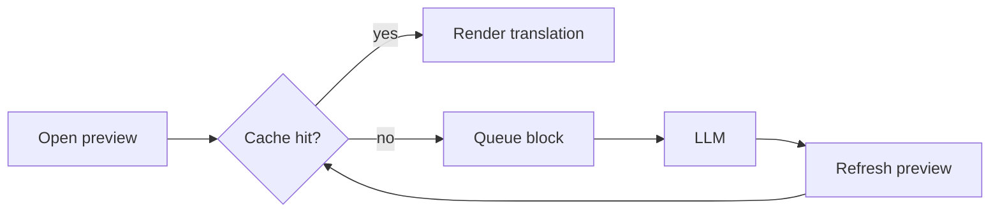

# A Long Document for Fill-In Testing

The harbour town woke slowly, its fishing boats nodding against the stone quay while gulls argued over the night's leftovers. Nobody could say exactly when the lighthouse keeper had stopped writing in the *logbook*, only that the last entry mentioned fog. A [narrow lane](https://example.com/lane) climbed from the market square to the chapel, lined with houses painted in faded blues and ochres.

## 1. The Harbour

Every configuration file in the project began with the same comment, and every comment was slightly out of date. The recipe called for `three cups` of flour, which the baker interpreted generously and without apology.

Rain arrived in the afternoon, not as a storm but as a patient, settled drizzle that seemed to have nowhere else to be. She kept the letters in a tin box under the stairs, sorted not by date but by how much each one had made her laugh. The river changed course twice in a century, and both times the maps were redrawn **long after** the farmers had noticed. Old engineers liked to say that every cache is a promise you will eventually break, usually on a Friday.


### Details

Across the valley, the bells of the monastery marked hours that no longer matched anyone's watch.

- The committee met on Tuesdays, adjourned on Tuesdays, and resolved, as far as anyone could tell, nothing at all.
- By the time the train reached the coast, the passengers had exchanged newspapers, sandwiches, and a remarkable number of opinions.
- The harbour town woke slowly, its fishing boats nodding against the stone quay while gulls argued over the night's leftovers.

> Nobody could say exactly when the lighthouse keeper had stopped writing in the *logbook*, only that the last entry mentioned fog. A [narrow lane](https://example.com/lane) climbed from the market square to the chapel, lined with houses painted in faded blues and ochres.

Every configuration file in the project began with the same comment, and every comment was slightly out of date. The recipe called for `three cups` of flour, which the baker interpreted generously and without apology. Rain arrived in the afternoon, not as a storm but as a patient, settled drizzle that seemed to have nowhere else to be.

## 2. The Lighthouse

She kept the letters in a tin box under the stairs, sorted not by date but by how much each one had made her laugh. The river changed course twice in a century, and both times the maps were redrawn **long after** the farmers had noticed.

Old engineers liked to say that every cache is a promise you will eventually break, usually on a Friday. Across the valley, the bells of the monastery marked hours that no longer matched anyone's watch. The committee met on Tuesdays, adjourned on Tuesdays, and resolved, as far as anyone could tell, nothing at all. By the time the train reached the coast, the passengers had exchanged newspapers, sandwiches, and a remarkable number of opinions.

### Details

The harbour town woke slowly, its fishing boats nodding against the stone quay while gulls argued over the night's leftovers.

- Nobody could say exactly when the lighthouse keeper had stopped writing in the *logbook*, only that the last entry mentioned fog.
- A [narrow lane](https://example.com/lane) climbed from the market square to the chapel, lined with houses painted in faded blues and ochres.
- Every configuration file in the project began with the same comment, and every comment was slightly out of date.

> The recipe called for `three cups` of flour, which the baker interpreted generously and without apology. Rain arrived in the afternoon, not as a storm but as a patient, settled drizzle that seemed to have nowhere else to be.

1. She kept the letters in a tin box under the stairs, sorted not by date but by how much each one had made her laugh. The river changed course twice in a century, and both times the maps were redrawn **long after** the farmers had noticed.

2. Old engineers liked to say that every cache is a promise you will eventually break, usually on a Friday.

3. Across the valley, the bells of the monastery marked hours that no longer matched anyone's watch. The committee met on Tuesdays, adjourned on Tuesdays, and resolved, as far as anyone could tell, nothing at all.

| Item | Note |
| --- | --- |
| Tide | By the time the train reached the coast, the passengers had exchanged newspapers, sandwiches, and a remarkable number of opinions. |
| Wind | The harbour town woke slowly, its fishing boats nodding against the stone quay while gulls argued over the night's leftovers. |
| Light | Nobody could say exactly when the lighthouse keeper had stopped writing in the *logbook*, only that the last entry mentioned fog. |

A [narrow lane](https://example.com/lane) climbed from the market square to the chapel, lined with houses painted in faded blues and ochres. Every configuration file in the project began with the same comment, and every comment was slightly out of date. The recipe called for `three cups` of flour, which the baker interpreted generously and without apology.

## 3. The Market Square

Rain arrived in the afternoon, not as a storm but as a patient, settled drizzle that seemed to have nowhere else to be. She kept the letters in a tin box under the stairs, sorted not by date but by how much each one had made her laugh.

The river changed course twice in a century, and both times the maps were redrawn **long after** the farmers had noticed. Old engineers liked to say that every cache is a promise you will eventually break, usually on a Friday. Across the valley, the bells of the monastery marked hours that no longer matched anyone's watch. The committee met on Tuesdays, adjourned on Tuesdays, and resolved, as far as anyone could tell, nothing at all.



### Details

By the time the train reached the coast, the passengers had exchanged newspapers, sandwiches, and a remarkable number of opinions.

- The harbour town woke slowly, its fishing boats nodding against the stone quay while gulls argued over the night's leftovers.
- Nobody could say exactly when the lighthouse keeper had stopped writing in the *logbook*, only that the last entry mentioned fog.
- A [narrow lane](https://example.com/lane) climbed from the market square to the chapel, lined with houses painted in faded blues and ochres.

> Every configuration file in the project began with the same comment, and every comment was slightly out of date. The recipe called for `three cups` of flour, which the baker interpreted generously and without apology.

Rain arrived in the afternoon, not as a storm but as a patient, settled drizzle that seemed to have nowhere else to be. She kept the letters in a tin box under the stairs, sorted not by date but by how much each one had made her laugh. The river changed course twice in a century, and both times the maps were redrawn **long after** the farmers had noticed.

## 4. Configuration Folklore

Old engineers liked to say that every cache is a promise you will eventually break, usually on a Friday. Across the valley, the bells of the monastery marked hours that no longer matched anyone's watch.

The committee met on Tuesdays, adjourned on Tuesdays, and resolved, as far as anyone could tell, nothing at all. By the time the train reached the coast, the passengers had exchanged newspapers, sandwiches, and a remarkable number of opinions. The harbour town woke slowly, its fishing boats nodding against the stone quay while gulls argued over the night's leftovers. Nobody could say exactly when the lighthouse keeper had stopped writing in the *logbook*, only that the last entry mentioned fog.


### Details

A [narrow lane](https://example.com/lane) climbed from the market square to the chapel, lined with houses painted in faded blues and ochres.

- Every configuration file in the project began with the same comment, and every comment was slightly out of date.
- The recipe called for `three cups` of flour, which the baker interpreted generously and without apology.
- Rain arrived in the afternoon, not as a storm but as a patient, settled drizzle that seemed to have nowhere else to be.

> She kept the letters in a tin box under the stairs, sorted not by date but by how much each one had made her laugh. The river changed course twice in a century, and both times the maps were redrawn **long after** the farmers had noticed.

1. Old engineers liked to say that every cache is a promise you will eventually break, usually on a Friday. Across the valley, the bells of the monastery marked hours that no longer matched anyone's watch.

2. The committee met on Tuesdays, adjourned on Tuesdays, and resolved, as far as anyone could tell, nothing at all.

3. By the time the train reached the coast, the passengers had exchanged newspapers, sandwiches, and a remarkable number of opinions. The harbour town woke slowly, its fishing boats nodding against the stone quay while gulls argued over the night's leftovers.

```ts
export function key(source: string, model: string): string {
  return `${model}\u0000${source}`;
}
```

Nobody could say exactly when the lighthouse keeper had stopped writing in the *logbook*, only that the last entry mentioned fog. A [narrow lane](https://example.com/lane) climbed from the market square to the chapel, lined with houses painted in faded blues and ochres. Every configuration file in the project began with the same comment, and every comment was slightly out of date.

## 5. The Bakery

The recipe called for `three cups` of flour, which the baker interpreted generously and without apology. Rain arrived in the afternoon, not as a storm but as a patient, settled drizzle that seemed to have nowhere else to be.

She kept the letters in a tin box under the stairs, sorted not by date but by how much each one had made her laugh. The river changed course twice in a century, and both times the maps were redrawn **long after** the farmers had noticed. Old engineers liked to say that every cache is a promise you will eventually break, usually on a Friday. Across the valley, the bells of the monastery marked hours that no longer matched anyone's watch.

### Details

The committee met on Tuesdays, adjourned on Tuesdays, and resolved, as far as anyone could tell, nothing at all.

- By the time the train reached the coast, the passengers had exchanged newspapers, sandwiches, and a remarkable number of opinions.
- The harbour town woke slowly, its fishing boats nodding against the stone quay while gulls argued over the night's leftovers.
- Nobody could say exactly when the lighthouse keeper had stopped writing in the *logbook*, only that the last entry mentioned fog.

> A [narrow lane](https://example.com/lane) climbed from the market square to the chapel, lined with houses painted in faded blues and ochres. Every configuration file in the project began with the same comment, and every comment was slightly out of date.

The recipe called for `three cups` of flour, which the baker interpreted generously and without apology. Rain arrived in the afternoon, not as a storm but as a patient, settled drizzle that seemed to have nowhere else to be. She kept the letters in a tin box under the stairs, sorted not by date but by how much each one had made her laugh.

## 6. Weather Notes

The river changed course twice in a century, and both times the maps were redrawn **long after** the farmers had noticed. Old engineers liked to say that every cache is a promise you will eventually break, usually on a Friday.

Across the valley, the bells of the monastery marked hours that no longer matched anyone's watch. The committee met on Tuesdays, adjourned on Tuesdays, and resolved, as far as anyone could tell, nothing at all. By the time the train reached the coast, the passengers had exchanged newspapers, sandwiches, and a remarkable number of opinions. The harbour town woke slowly, its fishing boats nodding against the stone quay while gulls argued over the night's leftovers.

### Details

Nobody could say exactly when the lighthouse keeper had stopped writing in the *logbook*, only that the last entry mentioned fog.

- A [narrow lane](https://example.com/lane) climbed from the market square to the chapel, lined with houses painted in faded blues and ochres.
- Every configuration file in the project began with the same comment, and every comment was slightly out of date.
- The recipe called for `three cups` of flour, which the baker interpreted generously and without apology.

> Rain arrived in the afternoon, not as a storm but as a patient, settled drizzle that seemed to have nowhere else to be. She kept the letters in a tin box under the stairs, sorted not by date but by how much each one had made her laugh.

1. The river changed course twice in a century, and both times the maps were redrawn **long after** the farmers had noticed. Old engineers liked to say that every cache is a promise you will eventually break, usually on a Friday.

2. Across the valley, the bells of the monastery marked hours that no longer matched anyone's watch.

3. The committee met on Tuesdays, adjourned on Tuesdays, and resolved, as far as anyone could tell, nothing at all. By the time the train reached the coast, the passengers had exchanged newspapers, sandwiches, and a remarkable number of opinions.

| Item | Note |
| --- | --- |
| Tide | The harbour town woke slowly, its fishing boats nodding against the stone quay while gulls argued over the night's leftovers. |
| Wind | Nobody could say exactly when the lighthouse keeper had stopped writing in the *logbook*, only that the last entry mentioned fog. |
| Light | A [narrow lane](https://example.com/lane) climbed from the market square to the chapel, lined with houses painted in faded blues and ochres. |

Every configuration file in the project began with the same comment, and every comment was slightly out of date. The recipe called for `three cups` of flour, which the baker interpreted generously and without apology. Rain arrived in the afternoon, not as a storm but as a patient, settled drizzle that seemed to have nowhere else to be.

## 7. Letters Under the Stairs

She kept the letters in a tin box under the stairs, sorted not by date but by how much each one had made her laugh. The river changed course twice in a century, and both times the maps were redrawn **long after** the farmers had noticed.

Old engineers liked to say that every cache is a promise you will eventually break, usually on a Friday. Across the valley, the bells of the monastery marked hours that no longer matched anyone's watch. The committee met on Tuesdays, adjourned on Tuesdays, and resolved, as far as anyone could tell, nothing at all. By the time the train reached the coast, the passengers had exchanged newspapers, sandwiches, and a remarkable number of opinions.


### Details

The harbour town woke slowly, its fishing boats nodding against the stone quay while gulls argued over the night's leftovers.

- Nobody could say exactly when the lighthouse keeper had stopped writing in the *logbook*, only that the last entry mentioned fog.
- A [narrow lane](https://example.com/lane) climbed from the market square to the chapel, lined with houses painted in faded blues and ochres.
- Every configuration file in the project began with the same comment, and every comment was slightly out of date.

> The recipe called for `three cups` of flour, which the baker interpreted generously and without apology. Rain arrived in the afternoon, not as a storm but as a patient, settled drizzle that seemed to have nowhere else to be.

She kept the letters in a tin box under the stairs, sorted not by date but by how much each one had made her laugh. The river changed course twice in a century, and both times the maps were redrawn **long after** the farmers had noticed. Old engineers liked to say that every cache is a promise you will eventually break, usually on a Friday.

## 8. The Wandering River

Across the valley, the bells of the monastery marked hours that no longer matched anyone's watch. The committee met on Tuesdays, adjourned on Tuesdays, and resolved, as far as anyone could tell, nothing at all.

By the time the train reached the coast, the passengers had exchanged newspapers, sandwiches, and a remarkable number of opinions. The harbour town woke slowly, its fishing boats nodding against the stone quay while gulls argued over the night's leftovers. Nobody could say exactly when the lighthouse keeper had stopped writing in the *logbook*, only that the last entry mentioned fog. A [narrow lane](https://example.com/lane) climbed from the market square to the chapel, lined with houses painted in faded blues and ochres.


### Details

Every configuration file in the project began with the same comment, and every comment was slightly out of date.

- The recipe called for `three cups` of flour, which the baker interpreted generously and without apology.
- Rain arrived in the afternoon, not as a storm but as a patient, settled drizzle that seemed to have nowhere else to be.
- She kept the letters in a tin box under the stairs, sorted not by date but by how much each one had made her laugh.

> The river changed course twice in a century, and both times the maps were redrawn **long after** the farmers had noticed. Old engineers liked to say that every cache is a promise you will eventually break, usually on a Friday.

1. Across the valley, the bells of the monastery marked hours that no longer matched anyone's watch. The committee met on Tuesdays, adjourned on Tuesdays, and resolved, as far as anyone could tell, nothing at all.

2. By the time the train reached the coast, the passengers had exchanged newspapers, sandwiches, and a remarkable number of opinions.

3. The harbour town woke slowly, its fishing boats nodding against the stone quay while gulls argued over the night's leftovers. Nobody could say exactly when the lighthouse keeper had stopped writing in the *logbook*, only that the last entry mentioned fog.

```ts
export function key(source: string, model: string): string {
  return `${model}\u0000${source}`;
}
```

A [narrow lane](https://example.com/lane) climbed from the market square to the chapel, lined with houses painted in faded blues and ochres. Every configuration file in the project began with the same comment, and every comment was slightly out of date. The recipe called for `three cups` of flour, which the baker interpreted generously and without apology.

## 9. On Caches

Rain arrived in the afternoon, not as a storm but as a patient, settled drizzle that seemed to have nowhere else to be. She kept the letters in a tin box under the stairs, sorted not by date but by how much each one had made her laugh.

The river changed course twice in a century, and both times the maps were redrawn **long after** the farmers had noticed. Old engineers liked to say that every cache is a promise you will eventually break, usually on a Friday. Across the valley, the bells of the monastery marked hours that no longer matched anyone's watch. The committee met on Tuesdays, adjourned on Tuesdays, and resolved, as far as anyone could tell, nothing at all.

### Details

By the time the train reached the coast, the passengers had exchanged newspapers, sandwiches, and a remarkable number of opinions.

- The harbour town woke slowly, its fishing boats nodding against the stone quay while gulls argued over the night's leftovers.
- Nobody could say exactly when the lighthouse keeper had stopped writing in the *logbook*, only that the last entry mentioned fog.
- A [narrow lane](https://example.com/lane) climbed from the market square to the chapel, lined with houses painted in faded blues and ochres.

> Every configuration file in the project began with the same comment, and every comment was slightly out of date. The recipe called for `three cups` of flour, which the baker interpreted generously and without apology.

Rain arrived in the afternoon, not as a storm but as a patient, settled drizzle that seemed to have nowhere else to be. She kept the letters in a tin box under the stairs, sorted not by date but by how much each one had made her laugh. The river changed course twice in a century, and both times the maps were redrawn **long after** the farmers had noticed.

## 10. Monastery Bells

Old engineers liked to say that every cache is a promise you will eventually break, usually on a Friday. Across the valley, the bells of the monastery marked hours that no longer matched anyone's watch.

The committee met on Tuesdays, adjourned on Tuesdays, and resolved, as far as anyone could tell, nothing at all. By the time the train reached the coast, the passengers had exchanged newspapers, sandwiches, and a remarkable number of opinions. The harbour town woke slowly, its fishing boats nodding against the stone quay while gulls argued over the night's leftovers. Nobody could say exactly when the lighthouse keeper had stopped writing in the *logbook*, only that the last entry mentioned fog.


### Details

A [narrow lane](https://example.com/lane) climbed from the market square to the chapel, lined with houses painted in faded blues and ochres.

- Every configuration file in the project began with the same comment, and every comment was slightly out of date.
- The recipe called for `three cups` of flour, which the baker interpreted generously and without apology.
- Rain arrived in the afternoon, not as a storm but as a patient, settled drizzle that seemed to have nowhere else to be.

> She kept the letters in a tin box under the stairs, sorted not by date but by how much each one had made her laugh. The river changed course twice in a century, and both times the maps were redrawn **long after** the farmers had noticed.

1. Old engineers liked to say that every cache is a promise you will eventually break, usually on a Friday. Across the valley, the bells of the monastery marked hours that no longer matched anyone's watch.

2. The committee met on Tuesdays, adjourned on Tuesdays, and resolved, as far as anyone could tell, nothing at all.

3. By the time the train reached the coast, the passengers had exchanged newspapers, sandwiches, and a remarkable number of opinions. The harbour town woke slowly, its fishing boats nodding against the stone quay while gulls argued over the night's leftovers.

| Item | Note |
| --- | --- |
| Tide | Nobody could say exactly when the lighthouse keeper had stopped writing in the *logbook*, only that the last entry mentioned fog. |
| Wind | A [narrow lane](https://example.com/lane) climbed from the market square to the chapel, lined with houses painted in faded blues and ochres. |
| Light | Every configuration file in the project began with the same comment, and every comment was slightly out of date. |

The recipe called for `three cups` of flour, which the baker interpreted generously and without apology. Rain arrived in the afternoon, not as a storm but as a patient, settled drizzle that seemed to have nowhere else to be. She kept the letters in a tin box under the stairs, sorted not by date but by how much each one had made her laugh.

## 11. The Committee

The river changed course twice in a century, and both times the maps were redrawn **long after** the farmers had noticed. Old engineers liked to say that every cache is a promise you will eventually break, usually on a Friday.

Across the valley, the bells of the monastery marked hours that no longer matched anyone's watch. The committee met on Tuesdays, adjourned on Tuesdays, and resolved, as far as anyone could tell, nothing at all. By the time the train reached the coast, the passengers had exchanged newspapers, sandwiches, and a remarkable number of opinions. The harbour town woke slowly, its fishing boats nodding against the stone quay while gulls argued over the night's leftovers.

### Details

Nobody could say exactly when the lighthouse keeper had stopped writing in the *logbook*, only that the last entry mentioned fog.

- A [narrow lane](https://example.com/lane) climbed from the market square to the chapel, lined with houses painted in faded blues and ochres.
- Every configuration file in the project began with the same comment, and every comment was slightly out of date.
- The recipe called for `three cups` of flour, which the baker interpreted generously and without apology.

> Rain arrived in the afternoon, not as a storm but as a patient, settled drizzle that seemed to have nowhere else to be. She kept the letters in a tin box under the stairs, sorted not by date but by how much each one had made her laugh.

The river changed course twice in a century, and both times the maps were redrawn **long after** the farmers had noticed. Old engineers liked to say that every cache is a promise you will eventually break, usually on a Friday. Across the valley, the bells of the monastery marked hours that no longer matched anyone's watch.

## 12. The Coast Train

The committee met on Tuesdays, adjourned on Tuesdays, and resolved, as far as anyone could tell, nothing at all. By the time the train reached the coast, the passengers had exchanged newspapers, sandwiches, and a remarkable number of opinions.

The harbour town woke slowly, its fishing boats nodding against the stone quay while gulls argued over the night's leftovers. Nobody could say exactly when the lighthouse keeper had stopped writing in the *logbook*, only that the last entry mentioned fog. A [narrow lane](https://example.com/lane) climbed from the market square to the chapel, lined with houses painted in faded blues and ochres. Every configuration file in the project began with the same comment, and every comment was slightly out of date.

### Details

The recipe called for `three cups` of flour, which the baker interpreted generously and without apology.

- Rain arrived in the afternoon, not as a storm but as a patient, settled drizzle that seemed to have nowhere else to be.
- She kept the letters in a tin box under the stairs, sorted not by date but by how much each one had made her laugh.
- The river changed course twice in a century, and both times the maps were redrawn **long after** the farmers had noticed.

> Old engineers liked to say that every cache is a promise you will eventually break, usually on a Friday. Across the valley, the bells of the monastery marked hours that no longer matched anyone's watch.

1. The committee met on Tuesdays, adjourned on Tuesdays, and resolved, as far as anyone could tell, nothing at all. By the time the train reached the coast, the passengers had exchanged newspapers, sandwiches, and a remarkable number of opinions.

2. The harbour town woke slowly, its fishing boats nodding against the stone quay while gulls argued over the night's leftovers.

3. Nobody could say exactly when the lighthouse keeper had stopped writing in the *logbook*, only that the last entry mentioned fog. A [narrow lane](https://example.com/lane) climbed from the market square to the chapel, lined with houses painted in faded blues and ochres.

```ts
export function key(source: string, model: string): string {
  return `${model}\u0000${source}`;
}
```

Every configuration file in the project began with the same comment, and every comment was slightly out of date. The recipe called for `three cups` of flour, which the baker interpreted generously and without apology. Rain arrived in the afternoon, not as a storm but as a patient, settled drizzle that seemed to have nowhere else to be.

